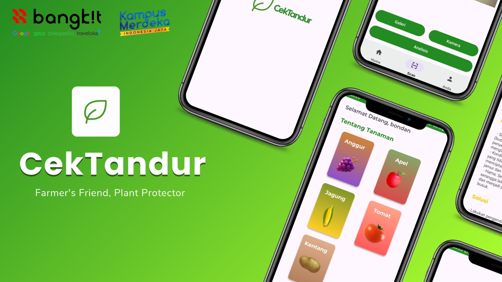
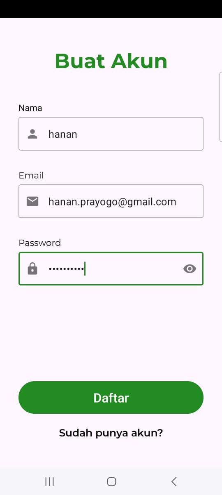
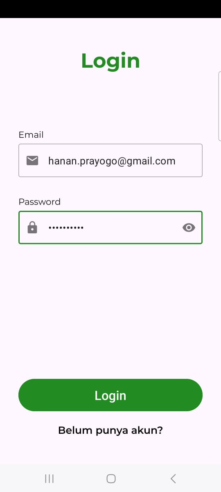
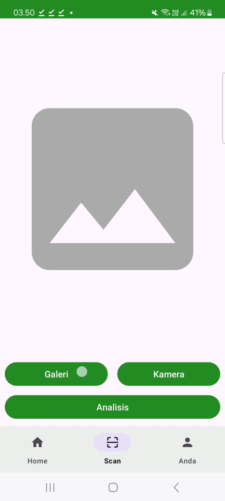
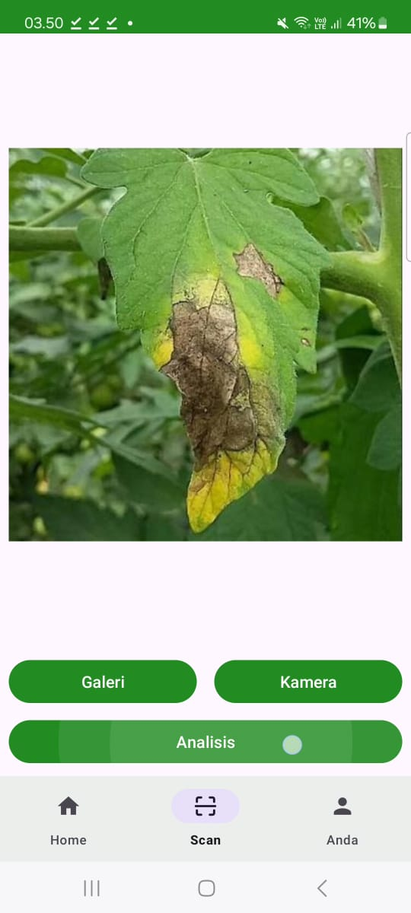
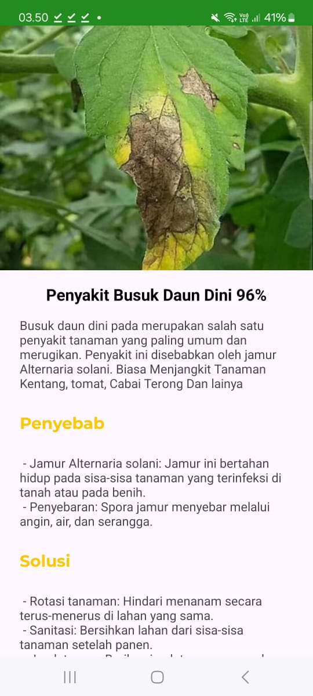
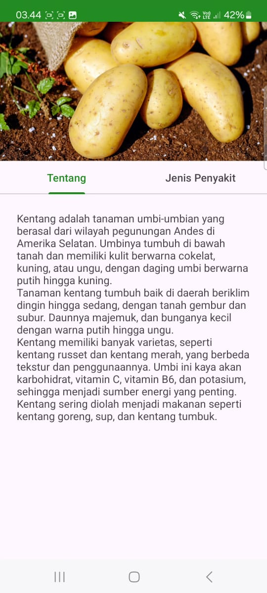
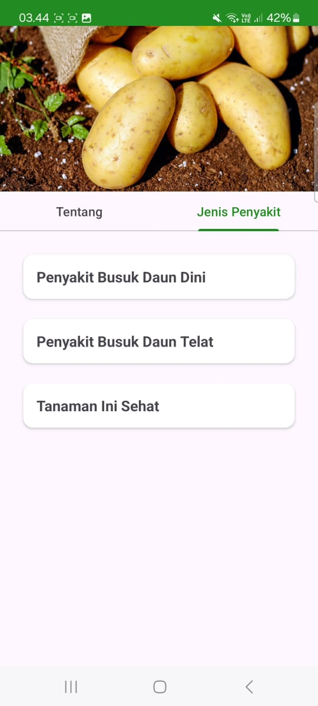

 
 

is an application that functions as a disease detector in plants by scanning one of the leaves on the plant. This project consists of 3 learning path teams, namely, Machine Learning, Mobile Development, Cloud Computing. This application can help families who like to garden in the yard when experiencing problems with plants in their homes, this application can tell users how to solve the problems that occur in these plants. 

---

## Our Team's ##

| *No* 	|             *Name*             	|    *ID*    	|      *Path*      	|                 *GitHub Username*                 	| *LinkedIn*                                                                        	|
|:------:	|:--------------------------------:	|:------------:	|:------------------:	|:---------------------------------------------------:	|-------------------------------------------------------------------------------------	|
|    1   	| Yudha Wahyu Saputra              	| M179B4KY4558 	| Machine Learning   	| [YudhaWS13](https://github.com/YudhaWS13)           	| [LinkedIn](https://www.linkedin.com/in/yudha-wahyu-saputra-463b8b30b/)              	|
|    2   	| Angger Tirta Tetalen Mukti       	| M179B4KY0551 	| Machine Learning   	| [HiiGER](https://github.com/HiiGER)                 	| [LinkedIn](https://www.linkedin.com/in/angger-tirta-tetalen-mukti-b361aa2ab/)       	|
|    3   	| Irwandika Malik Fadduani         	| M492B4KY2014 	| Machine Learning   	| [irwandikamalik](https://github.com/irwandikamalik) 	| [LinkedIn](https://www.linkedin.com/in/irwandika)                                   	|
|    4   	| Muhammad Hanan Rafi Hadi Prayogo 	| C179B4KY2876 	| Cloud Computing    	| [HananRafiHadi](https://github.com/HananRafiHadi)   	| [LinkedIn](https://www.linkedin.com/in/muhammad-hanan-rafi-hadi-prayogo-b2792a327/) 	|
|    5   	| Naelul Muna Alin Syarif          	| C179B4KY3219 	| Cloud Computing    	| [allsyariff](https://github.com/allsyariff)         	| [LinkedIn](https://www.linkedin.com/in/naelul-muna-alin-syarif-298629307/)          	|
|    6   	| Mujaddid Fathi Atho'illah        	| A179B4KY3143 	| Mobile Development 	| [mujaddidfa](https://github.com/mujaddidfa)         	| [LinkedIn](https://www.linkedin.com/in/mujaddidfa/)                                 	|
|    7   	| Rayhan Akbar Hidayat             	| A179B4KY3709 	| Mobile Development 	| [PanggilAjaRay](https://github.com/PanggilAjaRay)   	| [LinkedIn](https://www.linkedin.com/in/rayhan-akbar-hidayat-417547248)              	|

## How to install application "CekTandur" ##

  1. Download file [CekTandur](https://drive.google.com/drive/folders/1bUEwwUIqRfjozGewbw_2ZwlJdBNIx9Tc?usp=drive_link)
  2. Install CekTandur.apk on your devices
  3. Register account on the app
  4. Login!

## How to use to scan disease ##
  1. select a scanning option
  2. take a photo with the camera or upload it from the gallery</li>
  3. click the analyze button
  4. check the result that appears
  5. You can save the analysis result in the history

## Tech Stack ##
|                                                          **Mobile Development**                                                         	| **Machine Learning**                                                                                                                               	| **Cloud Computing**                                                              	|
|:---------------------------------------------------------------------------------------------------------------------------------------:	|----------------------------------------------------------------------------------------------------------------------------------------------------	|----------------------------------------------------------------------------------	|
| Android Studio                                                                                                                          	| Jupyter notebook                                                                                                                                   	| VS Code                                                                          	|
| Figma                                                                                                                                   	| Google Colab                                                                                                                                       	| Post Man                                                                         	|
| GitHub                                                                                                                                  	| GitHub                                                                                                                                             	| GitHub                                                                           	|
| Android Library : Glide Retrofit JUnit, Mockito Espresso Android KTX Lottie Jetpack: Room ViewModel/LiveData 	| Extension & Environment library : Python Tensorflow TensorFlow-lite Tensorflow JS Numpy Matplotlib Pandas Sklearn Keras 	| Google Cloud Platform : Cloud Storage Cloud Run App Engine Cloud SQL 	|

## Documentation ##
 
 
 
 

